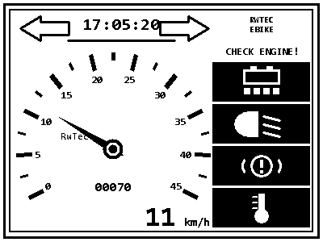

# RadDisplay auf ESP32-S3 mit reflektivem LCD

## Projektbericht — Stand August 2026

---

## Entstehung dieses Projekts

Konzeption und Umsetzung entstanden in gemeinsamer Arbeit mit der KI **Claude** von Anthropic. Die Zusammenarbeit verlief dabei als fortlaufender Dialog und nicht als reine Codegenerierung: Hardwareauswahl, Architekturentscheidungen und Layoutfragen wurden diskutiert, Zwischenstände als Screenshots zurückgespielt und daraufhin gemeinsam nachgebessert.

Gerade dieser Rückkopplungskreis war für das Ergebnis wesentlich. Mehrere Detailprobleme — die Kollision des Kilometerstands mit der Skala, die zu nah an ihren Strichen stehenden Skalenzahlen, die ausgefransten Kanten schräger Linien — wurden erst anhand der Bildschirmfotos aus dem laufenden Simulator erkannt und anschließend behoben. Auch Fehler auf Seiten der KI, etwa ein versehentlich doppelt eingefügter Codeblock, traten dabei zutage und wurden korrigiert.

---

## 1. Ausgangslage und Zielsetzung

Ziel des Projekts ist ein Fahrradcomputer im Stil klassischer Motorrad- und Fahrzeuginstrumente: ein analoger Rundtacho mit Zeiger und Skalenkranz, ergänzt um Uhrzeit, Kilometerstand, digitale Geschwindigkeitsanzeige, Blinkerpfeile und eine Spalte mit Warnsymbolen. Vorbild war ein Retro-Layout im Pixellook, wie es sich mit rein schwarz-weißen Displays besonders überzeugend umsetzen lässt.

Der bewusste Verzicht auf Graustufen und Farbe ist dabei kein Kompromiss, sondern Teil des gestalterischen Konzepts. Harte Pixelkanten wirken auf einem monochromen Reflexivdisplay eigenständig und gut lesbar, während weichgezeichnete Grafiken dort unsauber erscheinen.

## 2. Hardware

Als Plattform dient das Waveshare ESP32-S3-RLCD-4.2. Das Board vereint einen ESP32-S3 mit 8 MB Octal-PSRAM und ein 4,2 Zoll großes reflektives LCD mit 400 × 300 Pixeln, angesteuert über einen ST7305-Controller per SPI. Die Anzeige arbeitet rein schwarz-weiß und ohne Hintergrundbeleuchtung — sie nutzt das Umgebungslicht, ähnlich einem E-Paper, erreicht aber deutlich höhere Bildwiederholraten.

Für den Einsatz am Fahrrad bringt das Board erhebliche Vorteile mit: Der Kontrast steigt bei direkter Sonneneinstrahlung, statt wie bei herkömmlichen LCDs einzubrechen. Der Stromverbrauch liegt spürbar unter dem eines hintergrundbeleuchteten Displays.

Eine Einschränkung muss man kennen: Ohne Beleuchtung ist bei Dunkelheit nichts ablesbar. Für Nachtfahrten wäre eine externe Anleuchtung nötig — konstruktiv lösbar, aber ein Punkt, der in die Gehäuseplanung gehört.

Weitere bereits vorhandene Komponenten des Boards werden im Projekt genutzt:

| Baustein | Funktion im Projekt |
|---|---|
| PCF85063 RTC | Uhrzeitanzeige |
| SHTC3 | Temperaturüberwachung, Glättewarnung |
| ADC an GPIO4 | Akkuüberwachung über 3-fach-Spannungsteiler |
| Taster an GPIO18 | Umschaltung der Lichtanzeige |
| Stiftleiste | Anschluss des Hall-/Reedsensors an GPIO17 |

Die Geschwindigkeitserfassung erfolgt klassisch über einen einzelnen Magneten an der Speiche und einen Sensor am Rahmen. Der gemessene Radumfang beträgt 2160 mm.

Der 18650-Halter des Boards ist für den Fahrradbetrieb nicht die naheliegende Lösung — sinnvoller wäre eine Versorgung über einen DC/DC-Wandler aus dem Hauptakku des Rades.

---

## 3. Grundgedanke der Softwarearchitektur

Der zentrale Entwurfsgedanke ist die Trennung des Bildinhalts in zwei Ebenen.

Die **statische Ebene** enthält alles, was sich während des Betriebs nie ändert: Doppelrahmen, Skalenstriche, Skalenzahlen, die Einheit, den Schriftzug im Zifferblatt, den Text in der oberen rechten Ecke sowie die vier Symbolkästen in ihrem Ruhezustand. Diese Ebene wird einmal erzeugt und liegt anschließend als 15000 Byte großes Array im Flash des ESP32.

Die **dynamische Ebene** umfasst die beweglichen Elemente: Zeiger, Uhrzeit, Kilometerstand, digitale Geschwindigkeit sowie die Zustandswechsel von Blinkerpfeilen und Warnsymbolen.

Der Ablauf pro Bild ist damit denkbar einfach: Hintergrund in den Arbeitspuffer kopieren, bewegliche Teile darüberzeichnen, Puffer ans Display senden.

Der eigentliche Kunstgriff betrifft die Symbole. Sie liegen im Hintergrundbild in ihrer inaktiven Darstellung — weißer Kasten mit schwarzem Symbol. Der aktive Zustand aus dem Vorbild, also ein schwarzer Kasten mit weißem Symbol, entsteht durch schlichtes Umkehren aller Pixel im betreffenden Rechteck. Der Mikrocontroller braucht dadurch keine einzige Zeichenroutine für Batterie, Scheinwerfer, Warndreieck oder Thermometer. Aus vier verhältnismäßig aufwendigen Grafikfunktionen wird eine einzige, wenige Zeilen lange Invertierung.

Analog dazu steht der Warntext dauerhaft im Hintergrund und wird bei Bedarf weiß übermalt. Die Blinkerpfeile liegen als Umriss im Hintergrund; im aktiven Zustand füllt der Controller das zugehörige Polygon aus, dessen sieben Eckpunkte ebenfalls aus dem Entwurf stammen.

---

## 4. Der Delphi-Layoutsimulator

### 4.1 Aufbau

Für den **Layoutentwurf** entstand eine eigenständige VCL-Anwendung unter Delphi 12.1. Sie besteht aus drei Units: einer reinen Renderer-Unit ohne Oberflächenbezug, einer Export-Unit und dem Hauptformular, das vollständig im Quelltext aufgebaut wird und bewusst ohne Formulardatei auskommt.

Die Anwendung zeichnet das Display in Originalgröße von 400 × 300 Pixeln, ausschließlich in Schwarz und Weiß und mit abgeschaltetem Antialiasing, und zeigt es zweifach vergrößert an. Ein Schieberegler steuert die Geschwindigkeit, ein Demomodus lässt den Zeiger selbstständig pendeln, Kontrollkästchen schalten Blinker und Warnsymbole.

*Das fertige Layout in der Vorschau des Delphi-Simulators — 400 × 300 Pixel, rein schwarz-weiß, wie es später auf dem Reflexivdisplay erscheint.*

Entscheidend ist, dass die Anwendung intern exakt dasselbe Zweischichtenmodell verwendet wie später der Mikrocontroller: Sie hält den statischen Hintergrund als eigenes Bitmap, kopiert ihn vor jedem Bildaufbau und zeichnet die beweglichen Teile darüber. Was in der Vorschau zu sehen ist, entspricht damit nicht nur optisch, sondern auch verfahrenstechnisch dem Zielgerät.

### 4.2 Vorteile dieses Vorgehens

**Entwurfsgeschwindigkeit.** Der Unterschied ist erheblich. Eine Layoutänderung am Mikrocontroller bedeutet Kompilieren, Flashen, Gerät beobachten — je nach Projektgröße eine halbe bis mehrere Minuten pro Iteration. In Delphi sind es wenige Sekunden. Bei der Feinabstimmung eines Zifferblatts, wo es um einzelne Pixel geht, summiert sich das schnell auf Stunden.

**Sichtbarkeit von Kollisionen.** Mehrere Probleme wurden erst in der Vergrößerung sichtbar und ließen sich sofort beheben: Der Kilometerstand kollidierte mit einer Skalenzahl und wanderte daraufhin unter die Zeigernabe — den einzigen Bereich innerhalb des Zifferblatts, den der Zeiger konstruktionsbedingt nie überstreicht, da er senkrecht nach unten nie zeigt. Die Skalenzahlen berührten ihre eigenen Striche, weil breite Zahlen am unteren Bogenende seitlich in den Strich hineinragten. Der Zeiger war zu lang und schnitt bei mittleren Geschwindigkeiten in die Beschriftung. Die Symbolspalte stieß an den Rahmen.

**Qualität der Grafikprimitive.** Ein Detail, das ohne visuelle Kontrolle vermutlich unbemerkt geblieben wäre: Windows setzt bei schrägen Linien mit einer Strichstärke über einem Pixel die Endkappen unsauber. Auf einem monochromen Display ohne Kantenglättung ist jede ausgefranste Kante deutlich sichtbar. Die Skalenstriche werden deshalb nicht als Linien, sondern als gefüllte Vierecke gezeichnet, deren Eckpunkte selbst berechnet werden.

**Verlagerung der Rechenarbeit.** Alles, was sich vorab bestimmen lässt, wird auf dem PC bestimmt. Der Mikrocontroller führt zur Laufzeit keine einzige trigonometrische Berechnung aus.

**Eine einzige Quelle für alle Koordinaten.** Sämtliche Geometrie — Symbolrechtecke, Warntextrechteck, Pfeilpolygone, Ankerpunkte für Uhr, Kilometerstand und Digitalanzeige, Mittelpunkt und Radien des Zifferblatts — wird mitexportiert. Im Sketch steht keine einzige Koordinate doppelt. Eine Layoutänderung in Delphi wirkt sich nach einem Neuexport automatisch auf beiden Seiten aus, ein Auseinanderdriften von Vorschau und Gerät ist konstruktiv ausgeschlossen.

**Einheitliche Typografie.** Auch die beweglichen Ziffern werden aus Delphi exportiert. Andernfalls würden feste Skalenzahlen und bewegte Anzeigen unterschiedliche Schriftarten verwenden — ein Bruch, der sofort auffällt.

### 4.3 Die Exportkette

Drei Schaltflächen erzeugen die Übergabedateien:

Der **Hintergrundexport** liefert die statische Ebene als 15000-Byte-Array im Format 50 Byte je Zeile, MSB links, gesetztes Bit gleich schwarz. Beigefügt sind sämtliche Layoutkonstanten sowie das vorausberechnete Rechteck, das der Zeiger maximal überstreicht.

Die **Zeigertabelle** enthält für jede halbe km/h zwischen 0 und 45 die vier Eckpunkte des Zeigerpolygons — insgesamt 91 Einträge.

Der **Ziffernexport** rendert die Ziffern 0 bis 9 in drei Größen als Bitmapfont: 19 × 41 Pixel für die große Digitalanzeige, 12 × 24 Pixel einschließlich Doppelpunkt für die Uhr, 9 × 19 Pixel für den Kilometerstand.

Eine vierte Schaltfläche speichert die aktuelle Vorschau als Bilddatei.

---

## 5. Implementierung auf dem ESP32-S3

### 5.1 Grafikschicht

Der Arbeitspuffer umfasst 15000 Byte und liegt im internen RAM. Implementiert sind Pixelzugriff, Rechteckfüllung, Rechteckinvertierung, Kreisfüllung sowie eine Polygonfüllung nach dem Scanline-Verfahren. Letztere wird sowohl für den Zeiger als auch für die Blinkerpfeile verwendet. Die Textausgabe arbeitet ausschließlich mit den exportierten Bitmapfonts.

### 5.2 Geschwindigkeitsmessung

Dieser Teil verdient besondere Aufmerksamkeit, weil ein einzelner Magnet eine grundsätzliche Schwierigkeit mit sich bringt: Die Messwerte kommen selten. Bei 45 km/h vergehen zwischen zwei Impulsen 173 Millisekunden, bei 10 km/h bereits 778 Millisekunden, bei Schrittgeschwindigkeit über anderthalb Sekunden.

Zwei Konsequenzen ergeben sich daraus. Erstens würde eine Anzeige, die nur bei Impulsen aktualisiert, ruckartig springen. Dem begegnet eine exponentielle Glättung, die den Zeiger zwischen den Messungen weiterwandern lässt.

Zweitens — und gravierender — würde die Anzeige beim Anhalten auf dem letzten gemessenen Wert einfrieren, da schlicht kein weiterer Impuls eintrifft. Die Lösung besteht darin, nicht nur die letzte vollständige Umdrehung auszuwerten, sondern auch die seit dem letzten Impuls verstrichene Zeit. Ist diese bereits länger als die vorherige Umdrehung, kann das Rad nicht schneller geworden sein. Die Anzeige wird dann anhand der verstrichenen Zeit nach unten gerechnet und fällt von selbst gegen null. Nach vier Sekunden ohne Impuls gilt das Rad als stehend.

Im Interrupt sorgt eine Sperrzeit von 50 Millisekunden für die Unterdrückung des Kontaktprellens. Dieser Wert entspräche rechnerisch 155 km/h — was schneller eintrifft, kann nur Prellen sein.

### 5.3 Kilometerzähler

Der Zähler summiert Impulse und rechnet sie über den Radumfang in Meter um. Alle 100 gefahrene Meter wird der Stand im nichtflüchtigen Speicher abgelegt. Dieses Intervall ist ein bewusster Kompromiss zwischen Genauigkeit nach einem Stromausfall und Schonung des Flash-Speichers.

### 5.4 Peripherie und Anzeigelogik

Die Uhrzeit wird alle zwei Sekunden aus dem RTC gelesen; ein gemeldeter Oszillatorausfall führt zur Ersatzanzeige und aktiviert gleichzeitig das Störungssymbol. Der Akkustand ergibt sich aus der ADC-Messung, umgerechnet auf den Bereich zwischen 2,5 und 4,2 Volt. Die Temperatur dient der Glättewarnung unterhalb von 3 °C und einer Hitzewarnung oberhalb von 45 °C.

Das Bild wird alle 200 Millisekunden neu aufgebaut, allerdings nur dann tatsächlich übertragen, wenn sich am Inhalt etwas geändert hat. Die Übertragung ist der mit Abstand aufwendigste Teil eines Bildzyklus, und unnötige Übertragungen kosten Strom — genau die Ressource, deretwegen dieser Displaytyp gewählt wurde.

### 5.5 Offener Punkt: Display-Anbindung

Die Ansteuerung des ST7305 ist bislang nicht abgeschlossen. SPI-Konfiguration, Pinbelegung, Reset-Ablauf und die Sendefunktionen stehen, ebenso die vollständige Bildberechnung. Nicht enthalten sind die Initialisierungssequenz des Controllers und die Frage, ob dessen Speicheranordnung dem linearen Zeilenformat des Arbeitspuffers entspricht oder eine Umsortierung beim Senden erfordert.

Beides ist dem Beispielpaket von Waveshare zu entnehmen. Die Schnittstelle ist im Quelltext an zwei klar markierten Stellen isoliert, sodass eine eventuelle Umsortierung ausschließlich beim Senden stattfindet und der Arbeitspuffer sein sauberes Format behält.

---

## 6. Offene Punkte

**Inbetriebnahme des Displays.** Die genannten zwei Stellen sind zu ergänzen. Ein erster Erfolgsnachweis wäre die Darstellung des unveränderten Hintergrundbildes. Erscheint das Bild um 90 Grad gedreht, liegt es am Register für die Speicherzugriffsrichtung; erscheint es zerhackt oder gestreift, ist die Pixelanordnung nicht linear.

**Prüfung der Sensorik.** Der Sensor sollte zunächst am Schreibtisch mit einem von Hand geführten Magneten getestet werden, bevor er ans Rad kommt. Zu beobachten sind Zeigerlauf, Abfallverhalten beim Stillstand und die Zuverlässigkeit der Prellunterdrückung.

**Kalibrierung des Radumfangs.** Der angesetzte Wert von 2160 mm ist ein guter Ausgangspunkt, sollte aber durch Abrollen überprüft werden. Der Wert geht unmittelbar in Tachoanzeige und Kilometerzähler ein.

**Fahrpraktische Erprobung.** Ablesbarkeit bei unterschiedlichen Lichtverhältnissen, Verhalten bei Erschütterung, Stromaufnahme im Dauerbetrieb.

**Blinkereingänge.** Die Auswertung ist im Quelltext vorbereitet, aber deaktiviert. Sobald feststeht, wie die Blinker angesteuert werden, sind lediglich zwei Pinnummern einzutragen.

## 7. Ausblick

Als nächster sinnvoller Ausbauschritt bietet sich das partielle Bildaktualisieren an. Statt bei jeder Änderung das vollständige Bild zu übertragen, würde nur der Bereich gesendet, in dem sich der Zeiger bewegt. Das zugehörige Rechteck wird bereits mitexportiert und liegt einsatzbereit vor. Der Gewinn läge in geringerer Stromaufnahme und höherer möglicher Bildrate.

Darüber hinaus ist die Architektur offen für weitere Anzeigen — Trip-Kilometer, Durchschnitts- und Höchstgeschwindigkeit oder die Akkurestreichweite. Jede davon ist ein Eintrag im Delphi-Simulator, ein Neuexport und eine Textausgabe im Sketch.

---

*Erstellt von RwTec in Zusammenarbeit mit Claude (Anthropic), August 2026.*
